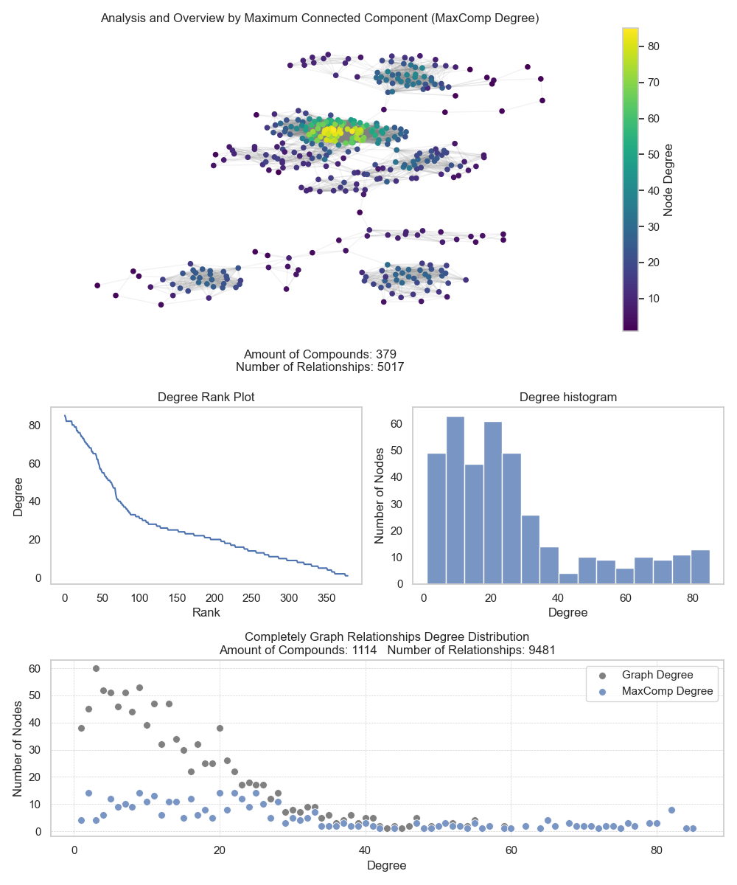

<p> </p>
<p> </p>

<h1 align="justify">
A Flexible Information Retrieval Architecture for Exploring and Assembling Molecular Space Domains For Drug Discovery and Repositioning Based on Computer-Aided Drug Design Strategies.
</h1>

<p> </p>
<p> </p>

<div style="display: inline-block;" align="center">
 
 
 


</div>

<p> </p>
<p> </p>

<div align="justify">

Managing the vast and complex data involved in analyzing compound–target relationships has become a growing challenge in computer-aided drug design (CADD). Large drug repositories, enriched with heterogeneous and voluminous metadata, often exceed the capabilities of traditional exploration strategies. As a result, building comprehensive and reliable research datasets is both costly and time-consuming. Moreover, defining robust methodologies for each drug discovery project requires clear rules to assess data quality, while also addressing missing, redundant, or inconsistent information, which further complicates the process.

BioMolExplorer was developed to overcome these challenges by providing an efficient and systematic approach to data management. The tool integrates and standardizes information from widely used drug databases such as PDB, ChEMBL, and ZINC, ensuring the generation of well-structured and research-ready datasets. By focusing on molecular entities associated with predefined therapeutic targets, BioMolExplorer ensures the retrieval of relevant and high-value information, streamlining the overall research workflow.

Its strategy enables the collection of bioactive molecules, structurally similar analogs, and enzyme complexes, all of which are essential for drug discovery and repositioning studies. Furthermore, its diverse filtering mechanisms allow researchers to tailor the extracted data to specific project requirements and scientific domains, significantly enhancing the precision and productivity of exploratory analyses. In addition, BioMolExplorer incorporates within its framework an automated redocking evaluation step within its framework, powered by the AutoDock Vina strategy, which enables a systematic assessment of the extracted proteins. This feature provides a curation layer for the downloaded PDB structures, ensuring validation of their quality and strengthening the reliability of downstream analyses.

</div>

#### Key Advantages:

> 1. **Comprehensive Data Retrieval**: Access to extensive drug banks of bioactive compounds and molecular structures is essential for robust drug discovery.
> 2. **Enhanced Target-Specific Insights**: Detailed analysis of molecular interactions aids in uncovering new drug candidates and understanding mechanisms of efficacy.
> 3. **Streamlined Data Processing**: Minimizes the need for labor-intensive preliminary data evaluations, enabling researchers to engage directly with high-quality, pertinent data.
> 4. **Support for Advanced Analytical Techniques**: The rich datasets support advanced analytical methods, enhancing drug discovery through predictive modeling and pattern recognition.
> 5. **Custom filters**: Enables information retrieval based on specific research constraints, facilitating the composition of data domain spaces that align with research objectives.
> 6. **Automated Redocking-Based Validation**: AutoDock Vina–based redocking module for protein quality assessment, ensuring reliable curation and reproducible datasets.

<p> </p>
<p> </p>

## Molecular Pre-Analysis and Modeling

<div align="justify">

This stage is dedicated to structuring drug–relationship networks and performing clustering analyses based on molecular signature affinity models. The signatures generated for each molecule serve as descriptors for evaluating the connectivity and organization of these networks. By identifying the maximum connected component and quantifying molecular similarity, BioMolExplorer enables the clustering and systematic assessment of compounds with shared signatures. This process supports the recognition of potential scaffolds (i.e., common molecular fragments) and the management of compound overlap constraints, particularly relevant in multi-target investigations. Such an approach substantially strengthens the development of advanced strategies for both drug discovery and drug repositioning. Figure 1 illustrates the identification of maximum connected components and common molecular fragments within the research process.

<div align="center">

</div>

<h6 align="justify">
Figure 1: Representation of variance in molecular structural feature overlap within a network model. Node relevance (i.e., the importance of each molecule) is evaluated in relation to the therapeutic target and its most prominent clinical investigations, as reported in the ChEMBL database. The in-degree rank plot illustrates the relationship between nodes and their interaction counts, while the degree histogram shows the distribution of key nodes across the network. The complete graph analysis highlights the overall degree distribution, emphasizing the role of the maximum connected component in capturing the most significant structural relationships.
</h6>

The largest connected component approach strengthens the identification of overlapping molecular features, particularly when applying multi-target strategies. This method enables the extraction of chemical signatures based on shared structural and functional properties, highlighting groups of compounds with the highest chemical similarity.

By focusing on the most significant connected component, BioMolExplorer provides a more robust framework for analyzing compounds most likely to interact with therapeutic targets or exhibit similar pharmacological profiles. At the same time, this strategy reduces noise in the chemical space under investigation and mitigates computational complexity, improving both efficiency and interpretability.

</div>

#### Benefits:

> 1. **Enhanced Data Organization**: Molecular information is structured into coherent clusters, facilitating efficient interpretation and comparative analysis.
> 2. **Identification of Key Molecular Interactions**: Evaluation of bond coefficients supports the detection of critical interactions relevant to drug discovery and repositioning.
> 3. **Efficient Drug Candidate Selection**: Clustering by molecular signature affinity streamlines the prioritization of promising drug candidates for subsequent validation.
> 4. **Support for Advanced Analytical Techniques**: Well-structured outputs enable the application of predictive modeling, pattern recognition, and other advanced computational approaches.
> 5. **Scaffold-Centric Exploration**: Analysis of maximum common scaffolds (cluster centroids) introduces an additional level of virtual screening, aiding in the exploration of shared structural cores within the chemical space.


# 🎯 How to BioMolExplorer on Linux Systems

BioMolExplorer is designed to run in Linux environments, and its installation process relies on directives specific to this operating system. To accommodate different Linux distributions, we provide two installation methods. The first is a generic approach applicable across distributions, while the second is an automated method tailored to the Ubuntu 24.04 distribution.

#### 1. General installation dependencies

1.1 ***Anaconda***
    - Download the latest version of Anaconda from the [Anaconda website](https://www.anaconda.com/download).
    - Make the downloaded installer executable with:
      ```bash
      chmod +x <downloaded_file.sh>
      ```
    - Install Anaconda by running the installer script:
      ```bash
      ./<downloaded_file.sh>
      ```

1.2 ***Create the Environment for BioMolExplorer***
    - Copy the BioMolExplorer folder to your preferred location on your system.
    - Navigate to the directory containing the `requirements.yml` file and create the conda environment with:
      ```bash
      conda env create -f environment.yml
      ```

1.1 ***Chimera***
    - Download the latest version of Chimera from the [Chimera website](https://www.cgl.ucsf.edu/chimera/download.html).
    - Make the downloaded installer executable with:
      ```bash
      chmod +x <downloaded_file.bin>
      ```
    - Install Chimera by running the installer script:
      ```bash
      ./<downloaded_file.bin>
      ```


#### 2. Ubuntu Linux distribution

2.1 ***Download Anaconda and Chimera***
    - Create an `apps` folder inside the main `BioMolExplorer` directory, if it does not already exist.
    - Place the Anaconda and Chimera installers in the `apps` folder.
    - Rename the Anaconda installer to `Anaconda-latest-Linux-x86_64.sh`.
    - Rename the Chimera installer to `chimera.bin`.

2.2 ***Alternative Method to Configure the Environment***
    - Navigate to the directory containing the `install.sh` file and perform:
      ```bash
      chmod +x install.sh
      ./install.sh
      ```


#### 3. Running BioMolExplorer

1. ***Using Visual Studio Code (VSCode)***
    - Download and install Visual Studio Code from the Ubuntu Software Center or the [official website](https://code.visualstudio.com/).

2. ***Configure VSCode***
    - Open VSCode and install the Python plugin from the Extensions marketplace.
    - Set the Python interpreter to the one associated with your Anaconda environment by selecting it from the Command Palette (`Ctrl+Shift+P`) and searching for "Python: Select Interpreter."
    - Locate BioMolExplorer in the presented list and select it.

3. ***Execute BioMolExplorer Scripts***
- Open the `BioMolExplorer` project folder in VSCode.
- Run the Python scripts located in the `workflow` folder in the following sequence:

  1. ***InformationRetrieval***: This stage performs data extraction from the **PDB**, **ChEMBL**, and **ZINC** datasets. For PDB, filters are applied through predefined functions. ChEMBL data is extracted using scripts and filters located in `src/scripts/crawlers`. Extraction from ZINC requires obtaining the dataset URIs from the official ZINC site and configuring their paths in BioMolExplorer to enable proper information retrieval.

  2. **Analysis**: The data analysis stage consists of three phases:  
     a) **Generate fingerprints** for molecular entities.  
     b) **Produce similarity references** based on molecular signatures.  
     c) **Analyze complex networks** to identify relationships and clustering patterns.  
     
     Additionally, the **redocking step** allows evaluation of PDB structures, providing a quality assessment of the extracted proteins.
      

## Authors

| [<br><sub> Michel Pires da Silva</sub>](http://lattes.cnpq.br/1449902596670082) |  [<br><sub> Alisson Marques da Silva</sub>](http://lattes.cnpq.br/3856358583630209) |  [<br><sub> Alex Gutterres Taranto</sub>](http://lattes.cnpq.br/4759006674013596) |
| :---: | :---: | :---: |
