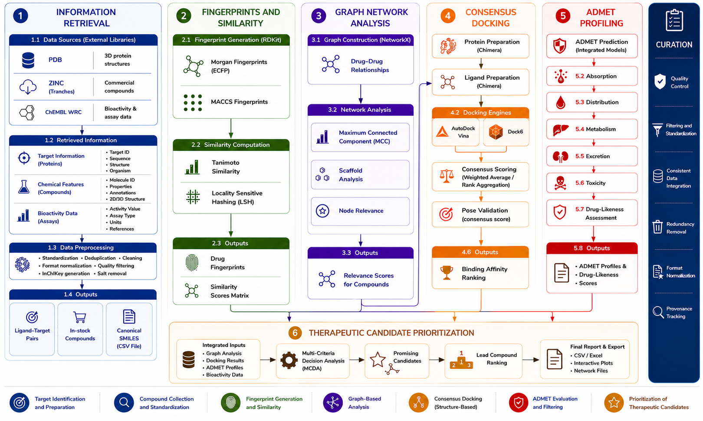

<p> </p>
<p> </p>

<h1 align="justify">
Molecular Data Exploration for Intelligent Drug Discovery
</h1>

<p> </p>
<p> </p>

<div style="display: inline-block;" align="center">
 
 
 


</div>

<p> </p>
<p> </p>

<div align="justify">

BioMolExplorer is an integrated computational framework designed to support Computer-Aided Drug Design (CADD) workflows through molecular information retrieval, similarity analysis, graph-based molecular exploration, consensus docking, redocking validation, and ADMET profiling.

The platform integrates data from major public repositories, including PDB, ChEMBL, PubChem, and ZINC, enabling the construction of research-ready datasets for drug discovery, drug repositioning, virtual screening, and polypharmacology investigations.

</div>

## Portable research projects

The Flet workspace stores each new project in a subfolder named after the project, inside the parent folder selected at creation. Existing destinations require confirmation before replacement; deleting a project permanently removes its associated folder after confirmation. Each project includes
portable configuration, inputs, results and version history. Project cards offer
export/import and an attributed change history with owner-controlled rollback.
Shared pipelines autosave and update across collaborators. Blocks support multiple
validated input files or supplied completed results, and ADMET EGG points reveal
compound identifiers and 2D structures, with a button to open the shared molecular
3D viewer used for proteins and retrieved compounds.

Graph blocks receive outputs from similarity stages, or validated external
similarity CSVs selected in their settings, with separate results for each input.
The pipeline follows fingerprints → similarity → graphs. Explore the full network and its highlighted MCC, inspect
molecular 2D structures, and download degree reports containing the common
fragment image. The [workspace guide](docs/en/frontend.md) explains the color
scales, source selection and fragment search status.

Read [Projects and versions](docs/en/projects.md) or
[Projetos e versões](docs/projects.md) for migration, sharing and input formats.

## Docking poses and molecular interactions

Vina and DOCK6 result viewers overlay the best pose with its docking receptor and
an available reference, preserving original coordinates. Receptor and ligand
styles are independent; ligand hydrogens can be shown or hidden when present in
the file. Colored dashed traces identify hydrogen bonds, parallel/T-shaped π–π,
hydrophobic contacts and geometric van der Waals contacts. Hover over a trace for
type, residue, chain and distance; use the matching legend and filters to inspect
individual types.

Classification requires valid chemistry and residue identities; hydrogen bonds
require explicit H. Unavailable classification is explained while distance
contacts remain accessible. DOCK6 Footprint is a separate per-residue energy
comparison with the final pose. Consensus exposes each engine’s 3D pose and an
available footprint; structural attachments are optional for score computation.
See the [viewer guide](docs/en/molecular_viewer.md)
([Português](docs/molecular_viewer.md)) for controls and interpretation.

## 🌐 Project Website

Complete documentation, installation instructions, workflow descriptions, and examples are available at:

**https://mpiress.github.io/BioMolExplorer/**


## 🚀 Core Capabilities

* Automated retrieval of molecular, structural, and bioactivity data.
* Integration with PDB, ChEMBL, PubChem, and ZINC databases.
* Molecular fingerprint generation (Morgan, MACCS, and Pharmacophore).
* Similarity analysis using Tanimoto-based metrics.
* Graph-based molecular network modeling.
* Redocking using AutoDock Vina, with explicit pair selection, per-pair preparation and an RMSD results table with simulation downloads and 3D inspection.
* Independent and consensus docking using AutoDock Vina and DOCK6, with pose/receptor overlays, interaction hover details and per-residue DOCK6 footprint inspection.
* Block information popups describing inputs and outputs, with concise notices for incompatible connections.
* Optional per-file compound selection for Vina/DOCK6, with no repeat input prompt when docking files are already configured.
* ADMET profiling for early-stage compound prioritization.
* Support for drug discovery and drug repositioning studies.

<p> </p>
<p> </p>


## 🏗 Framework Architecture

<p align="center">
  
</p>

BioMolExplorer integrates information retrieval, molecular fingerprint generation, similarity analysis, graph-based network modeling, consensus docking, and ADMET profiling into a unified computational pipeline for intelligent drug discovery.

## ⚡ Quick Start

**Before starting BioMolExplorer, install and configure UCSF Chimera 1.17 and DOCK6 6.11 on the computer that will run the calculations.** Installing the Python package or Conda environment does not install these external tools. The interface may open without them, but preparation, redocking and docking stages requiring them will fail. Follow the [installation and configuration guide](docs/en/installation.md) ([Português](docs/installation.md)) for official downloads, executable checks and DOCK6 path configuration. Git and Anaconda or Miniconda are also needed for the commands below.

Clone the repository:

```bash
git clone https://github.com/mpiress/BioMolExplorer.git
cd BioMolExplorer
```

Alternatively, open the [GitHub repository](https://github.com/mpiress/BioMolExplorer), select **Code → Download ZIP**, extract the archive and open a terminal in the extracted folder. Run the following commands from the folder containing `requirements.yml` and `pyproject.toml`.

Create and activate the Conda environment:

```bash
conda env create -f requirements.yml
conda activate BioMolExplorer
```

After installing the external tools, activating the environment and completing the guide's checks, install and start the interface. Replace the example DOCK6 path with its installation root containing `bin/` and `parameters/`; its `bin/` and Chimera's executable directory must be on `PATH`.

```bash
python -m pip install -e '.[ui]'
biomolexplorer-ui --web --dock6-path /path/to/dock6-6.11
```

Open `http://127.0.0.1:8550` and continue with the [user manual](docs/en/user_manual.md). Omit `--web` for desktop mode. Workflow modules remain available for scripted studies.


## 📂 Project Structure

```text
BioMolExplorer
│
├── workflow
│   ├── InformationRetrieval
│   └── Analysis
│
├── src
├── datasets
├── results
├── requirements.yml
└── install.sh
```


## Running BioMolExplorer

1. ***Using Visual Studio Code (VSCode)***
    - Download and install Visual Studio Code from the Ubuntu Software Center or the [official website](https://code.visualstudio.com/).

2. ***Configure VSCode***
    - Open VSCode and install the Python plugin from the Extensions marketplace.
    - Set the Python interpreter to the one associated with your Anaconda environment by selecting it from the Command Palette (`Ctrl+Shift+P`) and searching for "Python: Select Interpreter."
    - Locate BioMolExplorer in the presented list and select it.

3. ***Execute BioMolExplorer Scripts***
- Open the `BioMolExplorer` project folder in VSCode.
- Run the Python scripts located in the `workflow` folder in the following sequence:

  1. ***InformationRetrieval***: This stage performs data extraction from the **PDB**, **ChEMBL**, and **ZINC** datasets. For PDB, filters are applied through predefined functions. ChEMBL data is extracted using scripts and filters located in `src/biomolexplorer/resources/crawlers`. Extraction from ZINC requires obtaining the dataset URIs from the official ZINC site and configuring their paths in BioMolExplorer to enable proper information retrieval.

  2. **Analysis**: The data analysis stage consists of three phases:  
     a) **Generate fingerprints** for molecular entities.  
     b) **Produce similarity references** based on molecular signatures.  
     c) **Analyze complex networks** to identify relationships and clustering patterns.  
     
     Additionally, the **redocking step** allows evaluation of PDB structures, providing a quality assessment of the extracted proteins.
      

## How to configure BioMolExplorer for a specific target

To process your data, the project is organized into two main stages located in the `workflow` folder. Follow the order below to ensure data integrity and the correct generation of results.

### Retrieval Stage: `workflow/InformationRetrieval`

This stage is responsible for the extraction and standardization of data from public databases. Execute the scripts in the following order:

* **`11-pdb.py`**: Performs the loading of protein structures from the PDB. It allows filtering by Enzyme Commission (EC) number, resolution, and whether the presence of ligands in the complex is mandatory.
* **`retrieve_compounds.py`**: Retrieves target compounds and bioactivities from ChEMBL and expands the compound set with PubChem structural similars.
* **`13-zinc.py`**: Manages the collection of compound libraries based on configured URIs, focused on obtaining 3D structures for virtual screening.

---

#### 📦 PDB Download Configuration Guide

This section describes how to configure and execute the following Python function:

```python
load_pdb(
    target='Monoamine Oxidase B', 
    base_output_path='/datasets', 
    pdb_ec='1.4.3.1',
    PolymerEntityTypeID=[PolymerEntityType.PROTEIN],
    ExperimentalMethodID=[ExperimentalMethod.X_RAY_DIFFRACTION],
    max_resolution=2.0, 
    must_have_ligand=True
)
```

🔍 Overview

The `load_pdb` function is designed to retrieve protein structures from the Protein Data Bank (PDB) according to user-defined criteria. Each parameter allows fine control over the type and quality of structural data being downloaded.


⚙️ Parameter Description

**1. `target` and `base_output_path`**

* `target`: Defines the name of the main folder where the downloaded data will be stored.
* `base_output_path`: Specifies the root directory in which the folder defined by `target` will be created.

📁 **Resulting structure example:**

```
/datasets/Monoamine Oxidase B/
```


**2. `pdb_ec` (Enzyme Commission Number)**

* This parameter specifies the **Enzyme Commission (EC) number**, which uniquely identifies enzyme classes based on the reactions they catalyze.
* The EC number is obtained from the Protein Data Bank (PDB) or related biochemical databases.

🔬 **Example:**

* `'1.4.3.1'` corresponds to Monoamine Oxidase enzymes.


**3. `PolymerEntityTypeID`**

* Defines the **type of macromolecule** to be retrieved.
* This helps restrict the search to specific biological entities.

🧬 **Common options include:**

* `PROTEIN` → protein structures
* `DNA` → DNA molecules
* `RNA` → RNA molecules

✔️ In this example:

```python
[PolymerEntityType.PROTEIN]
```

Only protein structures will be downloaded.


**4. `ExperimentalMethodID`**

* Specifies the **experimental technique** used to determine the structure.

🔬 **Common methods include:**

* `X_RAY_DIFFRACTION`
* `NMR`
* `CRYO_EM`

✔️ In this case:

```python
[ExperimentalMethod.X_RAY_DIFFRACTION]
```

Only structures solved via X-ray crystallography will be considered.


**5. `max_resolution`**

* Defines the **maximum resolution (in Ångströms)** allowed for the selected structures.
* Lower values correspond to **higher structural quality**.

📏 **Example:**

```python
max_resolution=2.0
```

Only structures with resolution ≤ 2.0 Å will be downloaded.


**6. `must_have_ligand`**

* Indicates whether the retrieved structures must contain a **bound ligand**.

⚖️ Options:

* `True` → Only structures with ligands are included
* `False` → Structures without ligands are also allowed

✔️ In this example:

```python
must_have_ligand=True
```

Only ligand-bound structures will be retrieved.

---

#### 🧪 Compound Retrieval Guide

This section explains how to retrieve target compounds and bioactivities from ChEMBL and optionally expand the set with PubChem:

```python
from wrappers.crawlers import retrieve_compounds

retrieve_compounds(
    search_term='monoamine oxidase',
    base_output_path='/datasets',
    include_pubchem=True,
    pubchem_threshold=75,
    pubchem_max_records=1000,
)
```


🔍 Overview

The `retrieve_compounds` function retrieves chemical and bioactivity data for a biological target and optionally expands the compound set through PubChem. ChEMBL filters control the initial retrieval; `include_pubchem`, `pubchem_threshold` and `pubchem_max_records` configure the expansion.


⚙️ Main Parameters

**1. `search_term`**

* Defines the **name of the biological target**.
* ⚠️ This name must match exactly how the target is defined in the ChEMBL database.

✔️ Example:

```python
search_term='monoamine oxidase'
```


**2. `base_output_path`**

* Specifies the **directory where the extracted data will be stored**.

📁 Example:

```python
base_output_path='/datasets'
```


🧩 Additional Extraction Scripts

Beyond the main function, the system includes several auxiliary scripts located in:

```
src > scripts > crawlers
```

These scripts enable the extraction of different types of data using predefined filters, including:

* Therapeutic targets
* Bioactivity data
* Molecules
* Similar compounds


🧬 Filter Configurations

Below are the main filters used during the extraction process.


**1. Therapeutic Target Filters**

```json
{
    "organism": "Homo sapiens",
    "type__in": ["SINGLE PROTEIN"],
    "relationship_type": "DIRECT"
}
```

**Explanation:**

* `organism`: Selects targets from human organisms.
* `type__in`: Filters for specific target types (e.g., single proteins).
* `relationship_type`: Defines how the target relates to the `search_term` provided.


**2. Bioactivity Filters**

```json
{
    "standard_type__in": ["Ki", "IC50"],
    "molecule_type": "small molecule",
    "max_value_ref": 1000,
    "standard_units": "nM"
}
```

**Explanation:**

* `standard_type__in`: Types of activity measurements (e.g., binding affinity).
* `molecule_type`: Restricts to small molecules.
* `max_value_ref`: Maximum accepted activity value.
* `standard_units`: Unit of measurement (nanomolar).

**3. Molecule Filters**

```json
{
    "natural_product": 0
}
```

**Explanation:**

* `natural_product`:

  * `1` → include natural products
  * `0` → exclude natural products


**4. Similar Compound Filters**

```json
{
    "similarity": 60,
    "natural_product": 0,
    "molecule_type": "small molecule",
    "molecule_weight": 500
}
```

**Explanation:**

* `similarity`: Minimum similarity percentage compared to retrieved molecules.
* `natural_product`: Include or exclude natural products.
* `molecule_type`: Restricts to small molecules.
* `molecule_weight`: Maximum molecular weight allowed.


---

#### 🧬 ZINC Data Extraction Guide

This section describes how to configure and execute the script used to retrieve molecular data from the ZINC database.

```python
load_zinc(
    base_output_path='/datasets/ZINC',
    filename='ZINC2D.uri'
)
```

🔍 Overview

The `load_zinc` function processes a file containing **URIs for SMILES strings** obtained from the ZINC database. These URIs are used to download molecular structures and organize them locally.

⚠️ **Important:** Before running this script, the URI file must be downloaded manually from the ZINC database.


⚙️ Parameters

**1. `base_output_path`**

* Specifies the **directory where the URI file is located** and where the downloaded data will be stored.

📁 Example:

```python
base_output_path='/datasets/ZINC'
```


**2. `filename`**

* Defines the **name of the URI file** downloaded from ZINC.
* This file contains links that point to molecular data (SMILES format).

📄 Example:

```python
filename='ZINC2D.uri'
```


Legacy `verbose` arguments are ignored. Tool verbosity remains zero; execution status and errors are available in the workspace.

▶️ How to Use

**Step 1 — Download the URI File**

* Access the ZINC database and download a file containing URIs for SMILES data (e.g., `ZINC2D.uri`).
* Save this file in your desired directory.


**Step 2 — Configure the Script**

* Set `base_output_path` to the directory where the file is located
* Provide the correct `filename`
* Review execution status and errors in the workspace


### 4.2. Analysis Stage: `workflow/2-Analysis`

After retrieval, this stage processes the data, validates structures, and generates similarity models:

* **`redocking.py`**: Executes the automated redocking process using **AutoDock Vina**. This script prepares the complexes and calculates the RMSD to validate the quality of the downloaded PDB structures, serving as an essential curation layer for subsequent analyses.
* **`dataAnalysis.py`**: Performs advanced data processing in three phases:
    1. **Fingerprint Generation**: Creates Morgan, MACCS, and Pharmacophore descriptors.
    2. **Similarity Calculation**: Computes metrics (e.g., Tanimoto) to compare molecular entities.
    3. **Network Analysis**: Constructs molecular affinity graphs, identifying connected components and common scaffolds, facilitating the identification of drug candidates.


#### 🔁 Redocking Procedure Guide

This section explains how to configure and execute the redocking process using the following script:

```python
perform_redocking(
    base_input_path='/datasets/PDB',
    target='Estruturas',
    pdb_codes=[['4M0E', '1YL', 604, 'A', 2.0]],
    base_output_path='/resultados/redocking',
    prepare_complex=True,
    charge_type='am1'
)
```

🔍 Overview

The `perform_redocking` function performs a **redocking workflow**, in which previously known protein–ligand complexes are reprocessed and docked again to validate docking protocols or assess reproducibility.

The script operates on a set of Protein Data Bank (PDB) structures and optionally prepares the molecular complexes prior to docking.


⚙️ Parameters

### **1. `base_input_path`**

* Defines the **root directory containing the PDB structures** to be used in the redocking process.

📁 Example:

```python
base_input_path='/datasets/PDB'
```

**2. `target`**

* Specifies the **target of interest**, corresponding to a subdirectory inside `base_input_path`.

📁 Example:

```python
target='Estruturas'
```

✔️ Expected structure:

```
/datasets/PDB/Estruturas/
```

**3. `base_output_path`**

* Defines the **directory where all redocking results will be stored**.

📁 Example:

```python
base_output_path='/resultados/redocking'
```

**4. `prepare_complex`**

* Determines whether the protein–ligand complexes should be **prepared before docking**.

⚖️ Options:

* `True` → Enables preparation (recommended)
* `False` → Uses existing prepared PDBQT files and finite ligand centers in `Prepared/centers.csv`

✔️ When enabled:

* A subfolder named `Prepared` is created inside the target directory
* Receptor and ligand preprocessing is performed automatically


**5. `charge_type`**

* Specifies the **charge model** applied during ligand preparation.

⚡ Example:

```python
charge_type='am1'
```

* Commonly used for semi-empirical charge assignment


🧩 Complex Preparation Workflow

When `prepare_complex=True`, the system uses auxiliary scripts located at:

```
src/biomolexplorer/resources/chimera
```

These scripts rely on command-line operations from **UCSF Chimera** to process molecular structures in the background.

The [Chimera replacement assessment](docs/en/chimera_migration.md) ([Português](docs/chimera_migration.md)) maps every current function and evaluates Python alternatives. Chimera remains required because complete scientific and configuration compatibility has not been established.

The [native DMS port report](docs/en/dms_migration.md) ([Português](docs/dms_migration.md)) describes the Python SES generator and its comparison with the official C distribution. NumPy and SciPy replace the DMS executable; the `.dms` format consumed by sphgen remains.


🧬 Complex selection and preparation

Configure validated receptor/ligand pairs in **Input Data**. One chain is used for both structures, and resolution comes from metadata. Select cofactors explicitly for each pair; none is retained by default. Receptor and ligand solvent/hydrogen settings are independent, and ligand preparation and conformation share one configuration. Preconfigured redocking reuses the selected pairs.

The generated complex selection is `select #0:.{chain}`; choosing FAD adds ` | :FAD`. Solvent and hydrogen options are applied during receptor and ligand preparation. Classic Chimera receives file paths without shell quotes, and failed scripts remain available for diagnosis.

See the [redocking guide](docs/en/redocking_configuration.md) ([Português](docs/redocking_configuration.md)) for setup, preflight checks, backend options and results. Completed stages display an RMSD table; **View simulation** lists the corresponding files with individual downloads, a simulation ZIP and 3D viewing for PDB, PDBQT and MOL2 in the browser.

### ⚠️ Important Notes

* All other commands in the script should be kept **unchanged** to ensure correct processing.
* Advanced users familiar with **Chimera terminal commands** may extend or modify the scripts.
* The system is designed to execute these commands **in the background**, following Chimera’s syntax and behavior.

--- 

#### 📊 Data Analysis Workflow Guide

This section describes the main steps implemented in the `dataAnalysis.py` script, located in the `workflow` folder. The workflow is responsible for transforming molecular data into meaningful similarity relationships and graph-based representations.

🔍 Overview

The analysis pipeline is composed of three main stages:

1. **Fingerprint generation**
2. **Similarity computation**
3. **Graph-based analysis**

Each stage builds upon the previous one, forming a structured workflow for molecular comparison and exploration.


🧬 1. Fingerprint Generation

```python
generate_fingerprints(
    base_input_path='/datasets/ChEMBL/DrugBank',
    morgan=True,
    maccs=True,
    pharmacophore=True
)
```

**Purpose**

This function converts molecular structures into **numerical representations (fingerprints)**, which are essential for computational comparison.

**Parameters**

* `base_input_path`: Directory containing molecular file defined by a csv description.
* `morgan`: Enables generation of **Morgan fingerprints** (circular fingerprints widely used in cheminformatics).
* `maccs`: Enables generation of **MACCS keys** (predefined structural keys).
* `pharmacophore`: Enables generation of **pharmacophore fingerprints** (captures functional features relevant for biological activity).

**Notes**

* Multiple fingerprint types can be generated simultaneously.
* These representations are stored in a subfolder (typically named `Fingerprints`) for subsequent analysis.


🔗 2. Similarity Computation

```python
compute_similarity(
    base_input_path='/datasets/ChEMBL/DrugBank/Fingerprints',
    base_output_path='/datasets/ChEMBL/DrugBank',
    metric=similarityFunctions.TanimotoSimilarity,
    fingerprint=fingerprints.Morgan                  
)
```

**Purpose**

This step computes **pairwise similarity scores** between molecules based on their fingerprints.

**Parameters**

* `base_input_path`: Directory containing previously generated fingerprints.
* `base_output_path`: Directory where similarity results will be saved.
* `metric`: Mathematical function used to compute similarity.

  * Common options: **Tanimoto**, Dice, Cosine.
* `fingerprint`: Specifies which fingerprint type to use in the comparison.

**Notes**

* The **Tanimoto similarity** is the most commonly used metric in cheminformatics.
* Results are typically stored in a `Similarity` folder.


🕸️ 3. Graph-Based Analysis

```python
analyze_graphs(
    base_input_path='/datasets/ChEMBL/DrugBank',
    similarity_path='/datasets/ChEMBL/DrugBank/Similarity',
    base_output_path='/datasets/ChEMBL/DrugBank/Graphs',
    mcs_timeout=30
)
```

**Purpose**

Use ready similarity files from one or more similarity stages, or validated
external CSVs with source,target,value columns. Each file produces a separate
full graph and MCC analysis. Configure metric and threshold in the similarity
stage; graph filtering retains the supplied relationships. MCC reports include the common fragment image,
degree rank, histogram and distribution. A time-limited fragment search is
labeled partial when its maximum size is not confirmed.

**Concept**

* Each molecule is represented as a **node**
* Similarity relationships above a given threshold form **edges**

This approach enables identification of:

* Molecular clusters
* Structural analogs
* Key compounds within a network

**Parameters**

* `base_input_path`: Directory containing similarity results.
* `base_output_path`: Directory where graph outputs will be stored.
* `metric`: Similarity metric used to define relationships.
* `fingerprint`: Fingerprint type used in the analysis.

---

## ▶️ How to Execute scripts in workflow folder

After configuring the parameters and filters:

1. Save the script as a `.py` file.
2. Navigate to the file location.
3. Right-click on the file.
4. Select the option to **run the script using Python via terminal**.

---

## 📜 License

Distributed under the MIT License.

# 📄 How to Cite Our Work

If you use the data from this study in your research, please cite the dataset as follows:

**Full Reference:**

Pires da Silva, M., Alves de Oliveira, T., Habib Bechelane Maia, E., Oliveira Mendes, G., Cristina Moreira Damázio, L., Brito Barbosa, D., Andrade Leite, F. H., Falkoski, L., Flores de Souza Marra, I., Siqueira Valle, M., Silva Matos Andrade, L., Čmelo, I., Fayne, D., Batista de Carvalho, P., Marques da Silva, A., & Gutterres Taranto, A. (2025). *Data-driven chemical domain for polypharmacology agents: Focus on Alzheimer’s disease*. Mendeley Data. https://doi.org/10.17632/5njg46dfj4.3

**Example of in-text citation:**

> (Pires da Silva et al., 2025)

<p> </p>
<p> </p>

## Authors

| [<br><sub> Michel Pires da Silva</sub>](http://lattes.cnpq.br/1449902596670082) |  [<br><sub> Alisson Marques da Silva</sub>](http://lattes.cnpq.br/3856358583630209) |  [<br><sub> Alex Gutterres Taranto</sub>](http://lattes.cnpq.br/4759006674013596) |
| :---: | :---: | :---: |

### Expansão ChEMBL → PubChem

O exemplo `workflow/1-InformationRetrieval/retrieve_compounds.py` executa a busca de
similares 2D na PubChem após recuperar moléculas e similares da ChEMBL:

```python
from wrappers.crawlers import retrieve_compounds

retrieve_compounds(
    search_term='CHEMBL220',
    base_output_path='/datasets',
    include_pubchem=True,
    pubchem_threshold=75,
    pubchem_max_records=1000,
)
```

Execute a partir da raiz do projeto, no ambiente `BioMolExplorer`.
`include_pubchem=False` (padrão da função) mantém o fluxo apenas ChEMBL.
Para expandir downloads existentes sem executar novamente a etapa ChEMBL:

```python
from wrappers.crawlers import expand_similar_compounds
expand_similar_compounds('CHEMBL220', '/datasets', threshold=75, max_records=1000)
```

Como nos outros wrappers, `/datasets` é relativo à raiz do projeto.
Os CSVs individuais de `ChEMBL/molecules/<alvo>` e
`ChEMBL/similars/<alvo>` fornecem as referências. Todas as estruturas válidas
são resolvidas em CIDs antes de baixar propriedades dos resultados, excluindo
compostos já presentes na ChEMBL. Há uma segunda deduplicação por SMILES
canônico com estereoquímica e InChIKey completo; estereoisômeros distintos
podem permanecer no conjunto. Referências com SMILES inválido são registradas
no log e ignoradas.

Saídas:

- `datasets/PubChem/similars/<alvo>/compounds.csv`: novos compostos únicos.
- `datasets/PubChem/similars/<alvo>/matches.csv`: relações entre referências
  ChEMBL e compostos novos, com o limiar de busca.
- `datasets/compounds/<alvo>/compounds.csv`: conjunto consolidado
  compatível com as colunas `molecule_chembl_id`, `canonical_smiles` e
  `molecule_properties` utilizadas pelas análises. Novos compostos usam
  identificadores `PUBCHEM<CID>` e a coluna `source` registra a origem.

A busca usa FastSimilarity 2D com Tanimoto dos fingerprints da PubChem
([documentação](https://pubchem.ncbi.nlm.nih.gov/docs/pug-rest)).
`PubChem_Threshold_Percent` registra o **limiar**, não um score individual.
`max_records` limita os resultados por referência; atingir o limite gera um
aviso de possível truncamento. Similaridade estrutural não atribui atividade
experimental aos novos compostos. O cache em `cache/` evita repetir respostas
bem-sucedidas nas reexecuções; para atualizar a consulta, remova o cache
correspondente. Falhas HTTP interrompem a etapa e permitem retomá-la com o
cache; os CSVs finais são escritos apenas após concluir a busca.

Testes locais sem acesso à API:

```bash
python -m unittest discover -s tests -v
```

O ponto de entrada do fluxo integrado é `retrieve_compounds(...)` e a expansão
isolada é `expand_similar_compounds(...)`. Atualize scripts externos para esses
nomes. Execute o exemplo renomeado com:

```bash
python workflow/1-InformationRetrieval/retrieve_compounds.py
```

O consolidado integrado fica em `datasets/compounds/<alvo>/compounds.csv`.
Arquivos produzidos anteriormente não são movidos; atualize o caminho de entrada
das análises para usar o novo consolidado. Diretórios e classes específicos das
fontes mantêm os nomes ChEMBL e PubChem para indicar a origem dos dados.

### Camada de aplicação para integração com Flet

Na interface, **Recuperar ChEMBL** e **Recuperar PubChem** são blocos separados.
O bloco ChEMBL recupera suas moléculas e bioatividades sem consultar PubChem.
PubChem aceita um SMILES, CID ou nome informado, um CSV enviado pelo usuário
ou compostos conectados de outro bloco. Os CSVs usam o mesmo contrato:
`molecule_chembl_id,canonical_smiles` (também são aceitos `name,smiles`).

Para entradas conectadas ou enviadas, escolha todas as referências ou um composto
específico no combo. Quando a origem ainda não foi executada, escolha o composto
no popup de entradas, após selecionar os arquivos. O limite de registros é aplicado
por referência. A saída PubChem contém somente os novos similares, em
`compounds/<coleção>/compounds.csv`; `PubChem/similars/<coleção>/matches.csv`
registra quais referências encontraram cada resultado.

Conecte as saídas ChEMBL e PubChem a ADMET, fingerprints ou docking. Use
**Processar individualmente** para analisar os arquivos separadamente ou
**Mesclar arquivos (merge)** para reuni-los. O modelo **ChEMBL + PubChem → ADMET**
já conecta as duas saídas ao ADMET com merge. A API de expansão integrada e os
blocos antigos continuam compatíveis com scripts e pipelines existentes.

A aplicação dispõe de serviços independentes da interface, CLI e supervisão de
tarefas em processos separados. O histórico, os estados, erros e caminhos dos
resultados são persistidos em SQLite. Cada tarefa possui seu próprio diretório,
com limites de concorrência, timeout e cancelamento.

- [Visualizador molecular e interações 3D](docs/molecular_viewer.md) · [English viewer guide](docs/en/molecular_viewer.md)
- [Manual do usuário: passo a passo completo](docs/user_manual.md) · [English user manual](docs/en/user_manual.md)
- [Instalação e configuração: GitHub, Chimera 1.17 e DOCK6 6.11](docs/installation.md) · [English installation guide](docs/en/installation.md)
- [Validação das etapas e conexões](docs/pipeline_validation.md)
- [Arquitetura, revisão técnica e limites](docs/architecture.md)
- [Instalação, CLI, operações e integração com Flet](docs/backend_usage.md)
- [Controlador assíncrono de exemplo](examples/flet_controller.py)
- [Workspace Flet: instalação, contas, projetos e pipelines](docs/frontend.md)
- [Documentação em português e inglês](docs/README.md)
- [English: workspace, backend and architecture](docs/index.html)

Antes de iniciar, instale Chimera 1.17 e DOCK6 6.11 e confira os executáveis conforme o guia de instalação. Na raiz do código baixado, com o ambiente científico ativo e as ferramentas no `PATH`:

```bash
python -m pip install -e '.[ui]'
biomolexplorer-ui --web --language pt --dock6-path /caminho/para/dock6-6.11
```

A interface inclui contas, projetos privados, compartilhamento por convite,
tags/cores, importação de arquivos próprios, editor de etapas e acompanhamento
de resultados. Cada etapa permite configurar seus argumentos e templates.

Os filtros e templates agora ficam em `src/biomolexplorer/resources`.
Os wrappers e workflows existentes permanecem disponíveis; a camada recomendada
para a interface utiliza `biomolexplorer.workspace.WorkspaceStore` e
`biomolexplorer.pipeline.PipelineService`, com `JobManager` supervisionando os workers.

Na tela de login, selecione inglês ou português. Sem `--language`, a interface inicia em inglês.

Information retrieval now supports optional EC/collection names for PDB searches and direct ChEMBL compound searches by name, IDs, similarity or substructure. See the [retrieval guide](docs/en/retrieval.md) ([Português](docs/retrieval.md)) for modes, limits, filters and query reports.

For troubleshooting, see [Logs and diagnostics](docs/en/logging.md) ([Português](docs/logging.md)): contextual text and JSONL events, per-job summaries, scientific command failure codes and filtered reports.


### Docking independente e consenso

Vina e DOCK6 aceitam compostos de qualquer bloco molecular ou arquivos do usuário, com receptores preparados em uma entrada separada. As poses podem ser reutilizadas nos dois sentidos Vina ↔ DOCK6. Ambos exportam `docking_results.csv` com código, SMILES, receptor, motor, score e caminho da conformação. As tabelas oferecem a pose calculada em 3D e remoção auditada. O consenso reúne todos os lotes selecionados e calcula somente a interseção por composto e receptor; quando vazia, informa o motivo e não calcula o bloco. Consulte o [manual](docs/user_manual.md#vina-dock6-e-consenso) e a [validação](docs/pipeline_validation.md). PubMed é uma fonte bibliográfica; não há um bloco de recuperação molecular PubMed.

O bloco **Prepare for docking** aceita receptor PDB bruto ou preparado no redocking e uma ou mais fontes de compostos (ChEMBL, PubChem, ZINC ou arquivos próprios). Selecione o receptor pronto sem os arquivos exclusivos do ligante; suas opções de preparo ficam desabilitadas. Receptores brutos e todos os candidatos externos mantêm suas configurações de preparo disponíveis. Escolha saída para Vina, DOCK6 ou ambos e conecte receptor e compostos às ferramentas selecionadas. Use merge para reunir fontes em uma execução. Consulte a [preparação no manual](docs/user_manual.md#preparacao-e-redocking) e o [relatório de validação](docs/validation/preparation_2026-10-08.json).

**Import my files** permite selecionar arquivos no disco ou aproveitar os já enviados, com tipos por arquivo, validação do conteúdo e remoção da seleção em uma tabela. **Retrieve ZINC** aceita listas TXT/URI e scripts exportados pelas tranches, baixa SMI/MOL2 (inclusive gzip/bzip2) e publica `compounds.csv` com conformações 3D quando disponíveis. Veja o [guia de tranches ZINC](docs/retrieval.md#tranches-zinc-2d-e-3d) e a [lista de exemplo](examples/zinc_tranches.uri).
