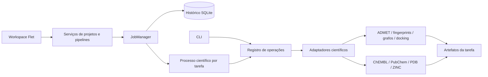

# Arquitetura e revisão técnica

[Documentação](README.md) · Português · [English](en/architecture.md)

A aplicação tem uma camada Python própria e um workspace Flet, com operações
explícitas, resultados serializáveis e execução científica
fora da interface. A revisão abrangeu os módulos Python, os wrappers, os scripts
de workflow, os templates, as configurações de ambiente e a documentação.
A validação científica dos métodos e a execução dos motores externos têm um
escopo diferente da validação da arquitetura descrita aqui.

## Estrutura

```text
src/
  biomolexplorer/
    diagnostics.py    logs centrais, rotação e tracebacks
    config.py         configurações de workspace e limites de recursos
    contracts.py      contratos de operação e resultado
    operations.py     registro e despacho dos casos de uso
    jobs.py           supervisão de tarefas e histórico SQLite
    worker.py         entrada do processo científico
    __main__.py       CLI que usa os mesmos casos de uso
    paths.py          caminhos absolutos e compatibilidade dos exemplos
    storage.py        gravação atômica e leitura/escrita de artefatos
    processes.py      execução dos motores com argv e timeout
    rate_limit.py     coordenação local de requisições PubChem
    workspace.py      contas, permissões, projetos e arquivos
    pipeline.py       dependências, snapshots e execução de pipelines
    stage_cache.py    integridade e reaproveitamento incremental de etapas
    compound_tables.py tabelas paginadas e curadoria autorizada/auditada
    graph_inputs.py   entradas independentes de grafos e proveniência dos compostos
    flow.py           tipos de portas, conexões e disposição visual
    catalog.py        metadados e parâmetros das etapas
    templates.py      validação e cópias de templates por etapa
    visualizations.py artefatos versionados de grafos/EGG e índice espacial
    ui/               autenticação, workspace e editor Flet
      flow_canvas.py  blocos, portas, zoom e histórico de edição
      guided.py       formulários e geração de configurações científicas
      compound_table.py tabelas de compostos e ações 2D/3D/remoção
      molecule_3d.py  renderização nativa de conformações moleculares
      results_viewer.py exploração de compostos e visualização nativa de gráficos
    resources/        filtros JSON e templates dos motores
  crawlers/           implementações dos provedores de dados
  caad/               implementações dos métodos científicos
    graph_results.py  comparação exata, fragmentos do MCC e figuras de graus
  kernel/             descritores, filtros e utilidades compartilhadas
  wrappers/           adaptação dos fluxos científicos existentes
workflow/             exemplos executáveis e compatibilidade
examples/             parâmetros JSON e controlador assíncrono para Flet
tests/                testes offline e integração local
docs/                 arquitetura, limites e uso
```

Os módulos científicos continuam em seus caminhos conhecidos. Essa escolha
permite introduzir a camada de aplicação sem obrigar os consumidores existentes
a atualizar simultaneamente todos os imports. Configurações e templates foram
movidos para `src/biomolexplorer/resources` e são incluídos no pacote instalável.
Os caminhos antigos de recursos usados internamente são resolvidos pelo adaptador.



A CLI executa a operação de forma síncrona. O workspace Flet usa `WorkspaceStore`
e `PipelineService`, que supervisiona cada etapa com `JobManager`. O controlador
assíncrono de exemplo também permite integrar operações isoladas. O processo
separado isola PyMOL, pools de CPU,
Matplotlib e ferramentas externas. A interface pode consultar o estado e
cancelar a tarefa sem executar essas rotinas no loop da UI. O padrão acompanha
as orientações de [tarefas assíncronas](https://flet.dev/docs/cookbook/async-apps/)
e [multiprocessing no Flet](https://flet.dev/docs/cookbook/multiprocessing/).

## Problemas encontrados e tratamento

| Área | Problema encontrado | Tratamento |
| --- | --- | --- |
| Inicialização | O cliente ChEMBL consultava a rede durante imports | Cliente carregado ao instanciar o crawler, depois das configurações |
| Caminhos | Concatenação com `cwd` e remoção do primeiro caractere quebravam caminhos absolutos e relativos | Resolução centralizada; `/datasets` continua relativo ao workspace e outros caminhos absolutos são preservados |
| Configuração | Filtros globais exigiam editar arquivos para cada execução | Filtros por chamada em `chembl_filters`; arquivos empacotados fornecem os padrões |
| Concorrência ChEMBL | Threads modificavam o mesmo dicionário de filtros | Cada consulta recebe uma cópia; referências repetidas não são submetidas novamente |
| Recursos de CPU | Uso de todos os cores e `cpu_count()-2` podia exceder recursos ou resultar em zero workers | `cpu_workers` explícito e fallback de pelo menos um worker |
| Erros | Wrappers e bibliotecas registravam erros e retornavam como se a execução tivesse concluído | Exceções operacionais propagam até a camada de tarefas, com estado `failed` e log |
| Supervisão | Falhas de inicialização/agendamento e histórico extenso podiam deixar locks ou tarefas pendentes | Lock liberado na inicialização malsucedida, agendamento malsucedido registrado como falha e encerramento consulta todas as tarefas ativas |
| Validação numérica | `radius` tinha significados diferentes em fingerprints e DOCK6 | Raio de fingerprint inteiro; raio DOCK6 decimal positivo; timeout positivo e finito |
| Bibliotecas | `exit(1)` encerrava a aplicação hospedeira | Exceções em código reutilizável |
| Logs | Imports criavam arquivos/diretórios e avisos eram ocultados globalmente | Handlers abrem arquivos sob demanda; logs de workers ficam separados; supressão global de avisos removida |
| Persistência | CSVs podiam ficar parcialmente escritos | Escrita atômica para substituições e saídas produzidas em blocos |
| Fingerprints | CSV inteiro e resultados de grandes lotes permaneciam na memória | Geração em blocos configuráveis; CSVs consolidados são reconhecidos pelas colunas |
| Similaridade | `eval` executava conteúdo dos CSVs | `ast.literal_eval` |
| Similaridade | Score 1 era descartado e somente o primeiro identificador com um fingerprint era considerado | Relações entre identificadores distintos são preservadas, incluindo score 1; sem autoarestas |
| Similaridade | Acúmulo de todas as arestas na memória | Saída incremental em blocos; o índice de fingerprints ainda ocupa memória |
| Métodos aproximados | Pré-seleção LSH era usada sem opção de busca exaustiva | `approximate=False` permite comparação exaustiva; modo aproximado continua padrão |
| ADMET | Moléculas marcadas como tóxicas eram contadas como excluídas, mas permaneciam na saída | Exclusão efetiva; CSV vazio mantém o esquema |
| Filtros | Inicialização das subclasses pulava a classe base; contagem de fragmentos comparava uma tupla com um inteiro | Inicialização correta, contagem de fragmentos e deduplicação estável |
| PubChem | Duplicatas entre bases e entre referências | Exclusão por CID antes de propriedades; deduplicação estrutural; relações de origem separadas |
| PubChem | Reexecuções e tarefas concorrentes repetiam consultas ou disputavam arquivos temporários | Cache persistente compartilhado no workspace, escrita atômica e coordenação do intervalo de requisições |
| HTTP | Política ChEMBL permitia timeout de um dia e alta concorrência; retentativas ZINC não eram usadas | Limites menores na ChEMBL; ZINC usa a sessão configurada e propaga falhas HTTP |
| Motores externos | Shell, comandos sensíveis a espaços, esperas artificiais e descritores não fechados | `argv`, timeout, redirecionamento explícito de showbox e sincronização com fechamento de descritores |
| Encadeamento | Algumas etapas exigiam dados e resultados no mesmo diretório | Entradas e saídas explícitas para expansão, ZINC, fingerprints, grafos e conformações Vina → DOCK6 |
| Redocking | O wrapper podia remover arquivos do diretório de entrada | A operação da camada de aplicação cria uma cópia de trabalho das estruturas |
| Preparação de docking | A cadeia do último complexo era reaproveitada em outros complexos; a primeira execução dependia de um CSV de centros já existente | Uso da cadeia de cada registro e criação inicial do CSV de centros |
| Distribuição | Ausência de pacote instalável e dependências diretas não declaradas no ambiente | `pyproject.toml`, CLI e dependências explícitas nos ambientes Conda |

As correções de ADMET, filtros e relações com score 1 alteram resultados que
antes estavam incorretos. Reexecute essas etapas se precisar que conjuntos
anteriores reflitam o comportamento corrigido.

## Contrato de aplicação

`OPERATIONS` registra nome, adaptador, parâmetros obrigatórios, opcionais e enums.
`validate_operation` rejeita operações desconhecidas, parâmetros inesperados,
nomes de alvo contendo separadores de caminhos e limites inválidos antes de
submeter trabalho. Os enums são convertidos a partir de nomes/valores JSON no
worker. As dependências científicas só são importadas durante o despacho.

`OperationResult` retorna:

```json
{
  "operation": "admet",
  "artifacts": ["/workspace/.biomolexplorer/jobs/<id>/artifacts/input.csv"],
  "details": {"rows": 10}
}
```

Os artefatos são caminhos locais; não há objetos RDKit ou DataFrames atravessando
a fronteira de processos. O campo de identificador `molecule_chembl_id` continua
como contrato de CSV para compatibilidade, inclusive para `PUBCHEM<CID>`.
Uma futura versão de esquema poderá adotar `compound_id`, com migração explícita.

## Ciclo das tarefas

```text
queued → running → succeeded
                 → failed
queued / running → cancelled
queued / running após parada inesperada → interrupted
```

Cada tarefa possui um UUID e arquivos próprios em
`<workspace>/.biomolexplorer/jobs/<uuid>/`:

- `request.json`: parâmetros originais da operação.
- `execution.log`: stdout e stderr do worker.
- `logs/`: logs das bibliotecas científicas.
- `artifacts/`: resultados e estruturas de trabalho.
- `result.json`: resultado serializável ou erro da operação.

O histórico fica em `.biomolexplorer/jobs.sqlite3`. Conexões são curtas e fechadas
por chamada. Há um supervisor por workspace, garantido por lock do sistema
operacional. `max_jobs`, `max_queued_jobs`, `cpu_workers` e `job_timeout` limitam
os recursos. `cancel` termina o grupo do processo, incluindo comandos e pools
que permaneçam no mesmo grupo. O gerenciador deve permanecer vivo durante a
sessão e ser fechado ao encerrar a aplicação.

Uma tarefa interrompida não é retomada automaticamente. Uma nova submissão
executa a operação novamente e aproveita respostas HTTP da PubChem já presentes
no cache. Dados ChEMBL de uma tarefa anterior podem servir de entrada para
`expand_similar_compounds` através de `base_input_path`.

## Limites e evolução

No workspace, `PipelineService` reaproveita etapas concluídas por projeto e ID
do bloco. A chave inclui parâmetros resolvidos, conexões, templates, código
científico e hashes dos dados de entrada; os hashes dos artefatos são verificados
antes do reaproveitamento. Posição e título do bloco não alteram essa chave.
Arquivos ausentes ou alterados exigem nova execução. Resultados antigos sem
metadados de cache podem ser adotados; entradas editadas após sua conclusão
impedem essa migração. A interface pergunta se o usuário deseja reaproveitar;
escolher **Não, executar novamente** ignora o cache de etapas. A seleção anterior
é restaurada para resultados compatíveis, inclusive após reinicialização. A adoção
entre versões verifica a proveniência original e reavalia entradas/configurações;
recalcular com um ambiente diferente continua sendo uma decisão científica explícita.

A curadoria de compostos verifica autoria, permissão, execução ativa e versão
do CSV sob transação SQLite. A substituição é atômica, com cópia original privada
e registro em `compound_edits`. Os manifestos das etapas que compartilham o CSV
são atualizados: a coleta permanece reaproveitável e os hashes das entradas
invalidam análises dependentes. Consultas usam leitura incremental e paginação;
a representação 3D gera um conformero RDKit e renderiza com canvas Flet local.

Esta implementação é um backend **local em Linux**, adequado à pilha científica
existente e à interface Flet desktop ou servida por um backend Python.
SQLite, subprocessos e locks locais não constituem uma fila distribuída. Para
múltiplos servidores, a camada de tarefas deverá ser substituída por workers
externos e armazenamento compartilhado; os contratos de operações são a fronteira
para essa evolução. Flet estático no navegador e mobile não executam diretamente
esta pilha de ferramentas nativas. Um aplicativo empacotado deve configurar
`worker_python` para um interpretador Python com o ambiente científico instalado.

A geração de fingerprints e a escrita de arestas usam blocos. O índice LSH e o
grafo NetworkX continuam em memória; grafos densos, comparações exaustivas e
visualizações grandes ainda têm custo elevado. O modo LSH aproxima a seleção
de candidatos; não garante recuperar todos os pares acima do limiar, sobretudo
quando usado como pré-filtro para métricas diferentes de Tanimoto. Use
`approximate=False` quando a completude dos pares for necessária e o conjunto
couber no custo quadrático. Não foram realizados benchmarks com milhões de
compostos.

As classificações ADMET existentes são heurísticas; esta refatoração não valida
modelos preditivos nem transforma essas classificações em evidência experimental.
Score, protonação, preparação de receptores, referências de RMSD e critérios de
consenso de docking exigem validação científica com os dados do estudo. O módulo
alternativo `caad/redocking.py` continua disponível, mas o wrapper ativo usa
`caad/docking.py`; consolidar essas implementações exige comparar seus resultados.

O instalador `install.sh` tem comportamentos independentes da arquitetura,
incluindo instalação com privilégios, aceitação de termos e dependência de
instaladores locais. Seu conteúdo não foi reescrito nesta etapa. Instalar as
ferramentas científicas continua sendo necessário para executar docking.

A CLI aceita caminhos locais confiáveis, incluindo caminhos absolutos. O workspace
Flet aplica autorização por projeto e restringe entradas, artefatos e configurações
ao seu escopo. Contas, convites, uploads e DAGs são persistidos em SQLite;
`PipelineService` coordena os workers e conserva snapshots por execução.
Consulte [o guia da interface](frontend.md) para instalação, formatos e limites.
Não há API HTTP pública dos serviços científicos nem isolamento por containers.

## Verificação

A suíte contém testes que executam importação sem rede, validação dos contratos, caminhos com
espaços, preservação de CSVs, propagação de erros, exclusões ADMET, deduplicação
PubChem e cache. Há integração real de worker ADMET, cancelamento, timeout,
histórico persistido e encadeamento fingerprints → similaridade → grafos.
A preparação de centros/cadeias também é testada com os motores simulados.
Convites de leitor/editor, recusa, mudança de papel, revogação e isolamento de
resultados têm testes de autorização. Os visualizadores têm testes de artefatos,
PNG/EGG, metadados moleculares, grafos vazios e sem arestas, empates no MCC,
hover/clique e pontos sobrepostos. A verificação local no navegador também cobre
convites, edição, acesso de leitor, revogação e exploração de gráficos.
Há regressões para convites alterados antes da aceitação, fechamento de janelas
após perda de acesso, respostas de consultas após logout e seleção de compostos
cuja renderização termina fora de ordem. Atualizações de colaboradores são
carregadas quando não há rascunho local, preservando o controle de revisões.
As consultas ChEMBL/PubChem são simuladas nos testes de recuperação; não foi
executada uma recuperação completa real nem um estudo de docking externo.
A construção e importação de wheel fora da árvore do projeto também são
verificadas, incluindo seus filtros e templates.

## Versionamento, portabilidade e colaboração

`project_locations` mapeia projetos para pastas escolhidas sem alterar o esquema
original de projetos. `project_state.py` mantém snapshots de metadados, membros,
assets, execuções concluídas, curadoria e arquivos por SHA-256 em `.history/`.
`project_history` identifica ação, autor e momento. Restaurações preparam os arquivos
e conferem os blobs antes da substituição; o diretório corrente é conservado para
recuperação se a operação falhar. Não há expurgo automático das versões.

`project_archive.py` exporta esses estados e arquivos sem credenciais. Importação
verifica manifesto, hashes, limite de expansão, caminhos e identificadores; ajusta
referências internas e adota resultados anteriores com configuração e integridade
compatíveis. Convites importados exigem aceite. `project_merge.py` reúne alterações
independentes; campos concorrentes geram conflito explícito. A interface salva
edições e consulta atualizações a cada dois segundos, preservando formulários abertos.

`bindings.py` compartilha as referências múltiplas entre canvas, DAG e cache.
`input_validation.py` valida os formatos científicos e une CSVs sem alterar os
originais. `provided_results` suspende as dependências de cálculo e registra
artefatos fornecidos. ADMET fornecido gera apenas a visualização dos descritores
existentes. Testes cobrem migração entre workspaces sem chamar o worker novamente,
restauração de arquivos e permissões, colisões de IDs, caminhos maliciosos, união
de entradas, validação e conflitos de colaboração. Veja [o guia de projetos](projects.md).

## Análises independentes de grafos

No modo individual, cada arquivo de similaridade selecionado gera uma análise
própria. No modo merge, relações e compostos selecionados são combinados em uma análise. Apenas blocos de
similaridade se conectam à entrada; arquivos externos validados e tabelas
opcionais de compostos também são aceitos.
`graph_inputs.py` percorre a cadeia de produtores para localizar os SMILES,
inclusive em fingerprints antigos sem metadados. Os caminhos resolvidos ficam
restritos ao projeto. A execução e a resolução do cache usam a configuração
guardada na execução; edições concorrentes do projeto não alteram uma análise
em andamento. As chaves incluem hashes dos arquivos e dos compostos inferidos,
independentemente dos caminhos da execução de origem.

`caad/graph_results.py` consome relações prontas validadas sem recalcular
similaridade. Arquivos externos sem tabela de compostos ainda geram topologia;
a interface informa que as estruturas e o fragmento estão indisponíveis.
A operação de grafos rejeita fingerprints e parâmetros de cálculo. Os helpers
científicos legados continuam disponíveis para chamadas Python independentes.
Arestas prontas duplicadas mantêm o maior peso, sem recalcular o conjunto.
Grafos completos preservam nós isolados. Layouts próprios do MCC, graus
normalizados, proveniência e estado da busca do fragmento acompanham os modelos
versionados. O visualizador nativo oferece escala de grau, zoom, organização
alternativa e popups moleculares. Serviços autorizados exportam os compostos
do MCC escolhido e uma figura com o fragmento e os painéis de graus.

Os testes cobrem individual e merge, nomes arbitrários de similaridade, rejeição
de fingerprints como entrada direta, aliases, conflitos de códigos entre entradas, timeout
de MCS, proveniência, permissões, invalidação de cache e controles na própria
etapa. Veja o [guia do frontend](frontend.md) para interpretação e limites.


## Revisão de contratos e localização

`flow.input_types` compartilha o contrato variável de redocking entre canvas, seletor e formulário. O consenso mantém o alias Vina sincronizado e reúne todas as seleções antes da interseção por receptor e código molecular. `docking_inputs.py` restringe DOCK6 aos candidatos e referências correspondentes. A materialização preserva auxiliares preparados e filtra centros/metadados pela mesma referência. Scores degenerados no consenso recebem normalização finita.

`ui/localization.py` usa um tradutor por sessão e catálogos JSON empacotados. Traduz controles e mensagens conhecidas ao renderizar/atualizar, sem alterar valores editáveis, chaves de seleção ou dados persistidos. `verbatim` protege conteúdos fornecidos pelo usuário e identificadores científicos. A escolha fica no login e o idioma inicial em `--language`; não há estado global compartilhado entre usuários. Logs científicos permanecem na linguagem original.

A [validação do pipeline](pipeline_validation.md) reúne matriz, regressões e limites. O [manual do usuário](user_manual.md) descreve a execução completa. Ambos têm tradução e navegação nas páginas HTML geradas.


## Avaliação da dependência Chimera

A [análise de substituição do Chimera](chimera_migration.md) registra as funções atuais, alternativas Python, contratos e critérios de validação. A revisão manteve o backend e as dependências científicas: equivalência completa ainda não foi demonstrada.

## Avaliação da dependência DMS

O [relatório do porte DMS](dms_migration.md) descreve a implementação SES nativa em `biomolexplorer.molecular_surface`, chamada diretamente pela preparação DOCK6. O formato DMS permanece como contrato com sphgen. NumPy e SciPy substituem a instalação do aplicativo; 31 superfícies de referência geradas pelo C validam o porte. Os fixtures não abrangem execução real de sphgen/docking.

## Recuperação flexível

`biomolexplorer.retrieval` centraliza modos, validação de identificadores e nomes seguros de coleções. PDB combina construtores RCSB com paginação POST limitada, retentativas/timeouts, downloads concorrentes validados e relatório de resultados. ChEMBL distingue busca de evidências por alvo de busca direta de moléculas; os campos da interface seguem o modo. Consulte [recuperação](retrieval.md) para contratos e limites.


## Controles de recuperação e curadoria de ligantes

`ui/color_palette.py` mantém códigos de cor internos e apresenta amostras visuais. Tags continuam aceitas no armazenamento para compatibilidade com projetos antigos, mas não são expostas nem utilizadas na busca da interface. `ui/folder_browser.py` uniformiza seleção no desktop/web, omite diretórios ocultos e cria e seleciona subpastas a partir do local atual.

`ui/pdb_results.py` oferece ações por estrutura nos resultados e na seleção de entradas. `ResultFiles.pdb_ligands` e `set_pdb_ligands` autorizam a estrutura e seu CSV pela execução/etapa, validam os resíduos reais, detectam conflitos por digest e salvam atomicamente com histórico e atualização dos manifests. O pipeline conserva a transferência automática dos metadados. `pdb_view.py` autoriza capacidades temporárias para o visualizador WebGL 3Dmol.js empacotado. O servidor desktop é restrito a loopback; `ui/web_host.py` monta as rotas privadas antes do Flet na mesma origem web.

`ui/activity_measures.py` pagina o snapshot público de `standard_type` em uma grade responsiva, preservando nomes científicos e seleção. O catálogo embarcado funciona sem novas chamadas de rede e aceita nomes adicionais. Organismos usam sugestões editáveis; ensaios usam os seis códigos oficiais descritos nos dois idiomas. Nenhuma dependência adicional foi necessária.


`project_folders.py` implementa destinos nomeados, confirmação vinculada ao estado da pasta e remoção permanente. A API `create_project_in_parent` recebe a pasta principal; `create_project(directory=...)` e a importação conservam o destino exato para compatibilidade. Operações de substituição/exclusão verificam propriedade, sobreposição, caminhos simbólicos e execuções ativas dentro de uma transação SQLite. A pasta antiga é movida para um diretório oculto irmão, permitindo restaurá-la se a criação falhar antes do commit. A exclusão física ocorre depois do commit, com registro persistente para repetir a limpeza em caso de falha. O visualizador converte endereços Flet `ws://`/`wss://` em páginas `http://`/`https://`, preservando host e porta.

## Regressões de redocking e idioma

A revisão inclui registros estruturados do pandas (que não aceitam fatiamento como listas), seleção pré-configurada sem nova solicitação, ausência de pares, resíduos inválidos, ferramentas ausentes, caminhos com espaços, cofatores e centros preparados. Erros de preparação são propagados com sua causa em vez de retornar um conjunto vazio.

Os testes percorrem formulários de todas as operações em inglês, verificam mensagens aninhadas de workers e preservam valores científicos e nomes personalizados. Rótulos dos templates, nomes padrão das etapas e seletores também acompanham o idioma da sessão. Mensagens originalmente em inglês são traduzidas para português quando apresentadas nessa sessão.

Os testes automatizados de integração substituem ferramentas externas na fronteira de execução. Após a análise dos logs de 6 de outubro de 2026, também foi executado o caso real 4M0E / 1YL / 604 / A com Chimera, Open Babel, Vina e PyMOL: com as opções originais, incluindo minimização do receptor e do ligante, o redocking concluiu e produziu RMSD de aproximadamente 0,149 Å. O teste complementar sem minimização produziu aproximadamente 0,215 Å. As execuções utilizaram cópias temporárias da entrada; esses resultados verificam o fluxo desse caso, sem estabelecer tolerâncias científicas para outros complexos.

## Consulta de resultados do redocking

`redocking_results.py` resolve simulações de etapas concluídas a partir dos metadados e do manifesto autorizado por `ResultFiles`. A identidade inclui a origem dos metadados e o par, mantendo coleções importadas independentes mesmo quando seus identificadores PDB coincidem. O serviço agrupa receptor, referência, poses e metadados associados; downloads ZIP preservam caminhos relativos para evitar colisões entre nomes. Cada leitura revalida a autorização do projeto.

`ui/redocking_results.py` apresenta a tabela paginada de RMSD e o popup de arquivos por simulação. Etapas em execução ou com falha continuam usando a consulta genérica de artefatos. `pdb_view.py` emite acessos temporários ao visualizador PDB/PDBQT/MOL2; troca de projeto ou sessão invalida ações pendentes. A visualização abre no navegador e usa o mesmo componente 3D dos PDBs recuperados.

Consulte [Logs e diagnóstico](logging.md) para o formato comum, contexto por execução, códigos de falha, resumo do job e o comando `python -m biomolexplorer.log_report`.


A camada `docking_data.py` preserva código, SMILES e pose nos dois sentidos Vina ↔ DOCK6. `result_tables` usa os resumos de todos os lotes e exclui tabelas redundantes por receptor. `DockingResults` e `DockingResultsTable` compartilham paginação, visualização das poses autorizadas e remoção auditada para os dois motores e o consenso. A seleção de esferas DOCK6 usa o centro do sítio preparado, permitindo candidatos independentes sem conformação Vina prévia.


`prepare_structures` também recebe `base_selected_mols`, `mol_filename` (padrão `compounds`), `receptor_prepared` e `docking_engines` (`vina`, `dock6` ou `both`). O pipeline identifica automaticamente receptores preparados nas entradas do redocking. Receptores prontos são copiados com seus arquivos complementares e centros, sem repetir o preparo; PDBs brutos seguem o preparo usado pelo redocking. Os candidatos externos são preparados em `Target/Compounds/compounds.csv`, com códigos e SMILES preservados e colunas `prepared_pdbqt` e/ou `prepared_mol2`. Vina e DOCK6 reutilizam esses arquivos sem outra minimização. O manifesto informa os formatos disponíveis; uma ferramenta cujo formato não foi exportado não pode usar essa saída. O CSV e todos os arquivos referenciados devem acompanhar a entrada. Chamadas legadas sem `base_selected_mols` continuam preparando somente estruturas.

Use um bloco separado para cada modo de receptor: não combine PDBs brutos com receptores preparados no mesmo bloco. O pH continua disponível para o preparo dos candidatos quando o receptor é reutilizado. Antes de preparar os compostos, o bloco verifica os centros do sítio (três coordenadas finitas) e os arquivos do receptor exigidos pela saída escolhida. Vina requer `.dockprep.pdbqt`; DOCK6 requer também `.dockprep.mol2` e `.noH.pdb`. O PDBQT permanece como arquivo de seleção do receptor nos dois casos. Arquivos ausentes interrompem o processo com o nome do arquivo necessário, sem refazer o preparo do receptor.

## Importação tipada e recuperação ZINC

`import_inputs.py` centraliza tipos por arquivo e validação de conjuntos, com fallback para `kind` em blocos antigos. `ui/import_files.py` oferece upload e seleção de arquivos do projeto na tabela de tipos, nomes e remoção. A interface valida o conteúdo ao enviar ou mudar o tipo; o pipeline revalida os grupos e publica a união dos tipos presentes em `asset_types`.

`zinc_retrieval.py` interpreta listas URI e scripts de download como dados, sem executá-los. Extrai e valida links, aplica retentativas e verifica redirecionamentos. Um `ThreadPoolExecutor` realiza até `download_workers` downloads simultâneos (padrão 4, limite 16), com sessão HTTP própria por tarefa e antecipação limitada. A consolidação molecular segue a ordem da lista na thread principal, evitando concorrência sobre a tabela e a escolha de conformeros. Downloads comprimidos são lidos por fluxo; MOL2s são separados em conformações individuais. Identificadores e estruturas são consolidados em `compounds.csv`, e `retrieval_report.json` registra a origem e os hashes. A materialização carrega as conformações referenciadas com a tabela; a preparação e os motores distinguem conformações de biblioteca de poses calculadas.

## Ajuda dos blocos, seleção de compostos e confirmação do docking

`ui/block_help.py` utiliza os contratos de `flow.py` para descrever entradas e saídas no popup de informação da biblioteca e do canvas. Conexões recusadas por validação são avisos esperados na interface, sem traceback; a edição permanece transacional e conserva o histórico de desfazer.

As referências de compostos do docking podem conter `compound_id`. `InputEditor` e `FileSelection` conservam a seleção por arquivo. `_materialize_docking_compounds` filtra cada referência, preserva conformações e arquivos preparados e só depois deduplica os compostos. A configuração da entrada faz parte da chave de materialização, separando seleções distintas do mesmo CSV. Um identificador ausente é recusado.

`requires_curation` preserva a seleção posterior para conexões automáticas. Docking Vina/DOCK6 com receptor e compostos previamente definidos por arquivo explícito executa sem repetir a confirmação. A validação dos arquivos, parâmetros e autorizações continua ocorrendo na resolução e na execução.
