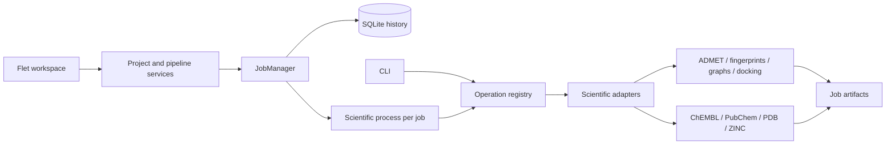

# Architecture and technical review

[Documentation](../README.md) · English · [Português](../architecture.md)

The application has a dedicated Python layer and a Flet workspace, with explicit
operations, serializable results and scientific execution outside the interface.
The review covered Python modules, wrappers, workflow scripts, templates,
environment configuration and documentation. Scientific method validation and
external engine execution have a different scope from the architecture
verification described here.

## Structure

```text
src/
  biomolexplorer/
    diagnostics.py    central logs, rotation and tracebacks
    config.py         workspace configuration and resource limits
    contracts.py      operation and result contracts
    operations.py     use-case registry and dispatch
    jobs.py           job supervision and SQLite history
    worker.py         scientific process entry point
    __main__.py       CLI using the same use cases
    paths.py          absolute paths and example compatibility
    storage.py        atomic writes and artifact I/O
    processes.py      engine execution with argv and timeouts
    rate_limit.py     local PubChem request coordination
    workspace.py      accounts, permissions, projects and files
    pipeline.py       dependencies, snapshots and pipeline execution
    stage_cache.py    output integrity and incremental stage reuse
    compound_tables.py paginated tables and authorized, audited curation
    graph_inputs.py   independent graph inputs and compound provenance
    flow.py           port types, connections and visual layout
    catalog.py        stage metadata and parameters
    templates.py      validation and per-stage template copies
    visualizations.py versioned graph/EGG artifacts and spatial hit testing
    ui/               Flet authentication, workspace and editor
      flow_canvas.py  draggable blocks, ports, zoom and editing history
      guided.py       typed forms and scientific configuration generation
      compound_table.py compound tables and 2D/3D/removal actions
      molecule_3d.py  native molecular conformer rendering
    resources/        JSON filters and engine templates
  crawlers/           data provider implementations
  caad/               scientific method implementations
    graph_results.py  exact comparisons, MCC fragments and degree exports
  kernel/             shared descriptors, filters and utilities
  wrappers/           adapters for existing scientific workflows
workflow/             executable examples and compatibility
examples/             JSON parameters and an asynchronous Flet controller
tests/                offline tests and local integration
docs/                 architecture, limitations and usage
```

Scientific modules remain at their familiar paths. This introduces the
application layer without requiring existing consumers to update every import
simultaneously. Configuration and templates moved to
`src/biomolexplorer/resources` and are included in the installable package.
The adapter resolves legacy internal resource paths.



The CLI runs operations synchronously. The Flet workspace uses `WorkspaceStore`
and `PipelineService`, which supervises each stage with `JobManager`. The example
asynchronous controller also supports integrating individual operations. A
separate process isolates PyMOL, CPU pools, Matplotlib and external tools. The
interface can query status and cancel jobs without running those routines in
the UI loop. This follows Flet guidance on [asynchronous tasks](https://flet.dev/docs/cookbook/async-apps/)
and [multiprocessing](https://flet.dev/docs/cookbook/multiprocessing/).

## Findings and changes

| Area | Finding | Change |
| --- | --- | --- |
| Initialization | The ChEMBL client accessed the network during imports | The client loads when the crawler is instantiated, after configuration |
| Paths | Concatenating `cwd` and removing the first character broke absolute and relative paths | Centralized resolution; `/datasets` stays workspace-relative and other absolute paths are preserved |
| Configuration | Global filters required editing files for each run | Per-call `chembl_filters`; packaged files provide defaults |
| ChEMBL concurrency | Threads modified the same filter dictionary | Each query receives a copy; repeated references are not submitted again |
| CPU resources | Using all cores or `cpu_count()-2` could overuse resources or yield zero workers | Explicit `cpu_workers` and a fallback of at least one worker |
| Errors | Wrappers and libraries logged errors but returned as if execution had succeeded | Operational exceptions reach the job layer, producing `failed` and a log |
| Supervision | Initialization/scheduling failures and large histories could leave locks or pending jobs | Failed initialization releases locks, scheduling failures are recorded, and shutdown queries all active jobs |
| Numeric validation | `radius` meant different things in fingerprints and DOCK6 | Integer fingerprint radius; positive decimal DOCK6 radius; positive finite timeout |
| Libraries | `exit(1)` terminated the host application | Exceptions in reusable code |
| Logs | Imports created files/directories and warnings were globally hidden | Lazy file handlers, separate worker logs and removal of global warning suppression |
| Persistence | CSVs could be partially written | Atomic replacements and chunked outputs |
| Fingerprints | Entire CSVs and large batch results remained in memory | Configurable chunks; consolidated CSVs are recognized by columns |
| Similarity | `eval` executed CSV content | `ast.literal_eval` |
| Similarity | Score 1 was discarded and only the first identifier for a fingerprint was considered | Preserve relationships between distinct identifiers, including score 1; omit self-edges |
| Similarity | All edges accumulated in memory | Incremental chunked output; the fingerprint index still uses memory |
| Approximate methods | LSH candidate selection had no exhaustive-search option | `approximate=False` enables exhaustive comparison; approximate mode remains the default |
| ADMET | Toxic compounds were counted as excluded but remained in output | Actual exclusion; empty CSVs retain their schema |
| Filters | Subclass initialization skipped the base class; fragment counting compared a tuple with an integer | Correct initialization, fragment counting and stable deduplication |
| PubChem | Duplicates across sources and references | CID exclusion before property retrieval, structural deduplication and separate provenance relationships |
| PubChem | Repeated/concurrent jobs duplicated queries or competed for temporary files | Persistent workspace-shared cache, atomic writes and coordinated request intervals |
| HTTP | ChEMBL allowed day-long timeouts and high concurrency; ZINC retries were unused | Lower ChEMBL limits; ZINC uses its configured session and propagates HTTP failures |
| External engines | Shell use, space-sensitive commands, artificial waits and unclosed descriptors | `argv`, timeouts, explicit showbox redirection and synchronization with descriptor closure |
| Chaining | Some stages required inputs and results in the same directory | Explicit inputs and outputs for expansion, ZINC, fingerprints, graphs and Vina → DOCK6 conformations |
| Redocking | The wrapper could delete files from its input directory | The application operation creates a working copy of structures |
| Docking preparation | The last complex's chain was reused for other complexes; the first run required an existing center CSV | Each record uses its own chain; initial center CSV creation |
| Distribution | No installable package and undeclared direct environment dependencies | `pyproject.toml`, CLI and explicit Conda environment dependencies |

ADMET, filter and score-1 relationship corrections change results that were
previously incorrect. Rerun those stages if earlier datasets need to reflect
the corrected behavior.

## Application contract

`OPERATIONS` registers names, adapters, required/optional parameters and enums.
`validate_operation` rejects unknown operations, unexpected parameters, target
names containing path separators and invalid limits before submission. Workers
convert enums from JSON names/values. Scientific dependencies are imported only
during dispatch.

`OperationResult` returns:

```json
{
  "operation": "admet",
  "artifacts": ["/workspace/.biomolexplorer/jobs/<id>/artifacts/input.csv"],
  "details": {"rows": 10}
}
```

Artifacts are local paths; RDKit objects and DataFrames do not cross process
boundaries. The `molecule_chembl_id` identifier field remains part of the CSV
contract for compatibility, including `PUBCHEM<CID>` values. A future schema
version may adopt `compound_id` with an explicit migration.

## Job lifecycle

```text
queued → running → succeeded
                 → failed
queued / running → cancelled
queued / running after an unexpected shutdown → interrupted
```

Each job has a UUID and its own files under
`<workspace>/.biomolexplorer/jobs/<uuid>/`:

- `request.json`: original operation parameters.
- `execution.log`: worker stdout and stderr.
- `logs/`: scientific library logs.
- `artifacts/`: results and working structures.
- `result.json`: serializable result or operation error.

History is stored in `.biomolexplorer/jobs.sqlite3`. Connections are short-lived
and closed per call. An operating system lock guarantees one supervisor per
workspace. `max_jobs`, `max_queued_jobs`, `cpu_workers` and `job_timeout` limit
resource usage. `cancel` terminates the process group, including commands and
pools that remain in the same group. The manager must stay alive throughout
the session and close when the application shuts down.

Interrupted jobs do not resume automatically. A new submission runs the
operation again and reuses PubChem HTTP responses already in the cache.
ChEMBL data from an earlier job can feed `expand_similar_compounds` through
`base_input_path`.

## Limitations and evolution

In the workspace, `PipelineService` reuses completed stages by project and block
ID. The key includes resolved parameters, bindings, templates, scientific source
code and input content hashes; output hashes are verified before reuse. Canvas
positions and block titles do not change this key. Missing or changed outputs
require execution. Legacy results without cache metadata may be adopted; inputs
edited after completion prevent this migration. The interface asks whether to reuse;
**No, run again** bypasses the stage cache. Previous selections are restored for
compatible results, including after restart. Adoption across versions verifies
original provenance and reevaluates inputs/configurations; recalculating with a
different environment remains an explicit scientific decision.

Compound curation checks identity, permission, active runs and the CSV version
under a SQLite transaction. Replacement is atomic, with a private original copy
and a `compound_edits` audit record. Manifests of stages sharing that CSV are
updated: retrieval remains reusable while input hashes invalidate dependent
analyses. Table queries use streaming reads and pagination; the 3D representation
generates an RDKit conformer rendered on a local Flet canvas.

This is a **local Linux backend**, suited to the existing scientific stack and
the desktop Flet interface or Flet served by a Python backend. SQLite, subprocesses
and local locks do not provide a distributed queue. For multiple servers, replace
the job layer with external workers and shared storage; operation contracts are
the boundary for that evolution. Static browser-only or mobile Flet cannot run
this native toolchain directly. A packaged application must configure
`worker_python` for an interpreter with the scientific environment installed.

Fingerprint generation and edge writing use chunks. The LSH index and NetworkX
graph remain in memory; dense graphs, exhaustive comparisons and large
visualizations still have high costs. LSH approximates candidate selection and
does not guarantee retrieving all pairs above a threshold, especially when used
as a prefilter for metrics other than Tanimoto. Use `approximate=False` when pair
completeness is required and the dataset fits the quadratic cost. No benchmarks
with millions of compounds have been performed.

Existing ADMET classifications are heuristic; this refactor does not validate
predictive models or turn those classifications into experimental evidence.
Scores, protonation, receptor preparation, RMSD references and docking consensus
criteria require scientific validation with study data. The alternative
`caad/redocking.py` module remains available, but the active wrapper uses
`caad/docking.py`; consolidating them requires comparing their results.

The `install.sh` installer has behavior independent of this architecture,
including privileged installation, terms acceptance and reliance on local
installers. It was not rewritten in this stage. Scientific tools still need to
be installed for docking execution.

The CLI accepts trusted local paths, including absolute paths. The Flet workspace
applies project-level authorization and restricts inputs, artifacts and
configuration to their scope. Accounts, invitations, uploads and DAGs are
persisted in SQLite; `PipelineService` coordinates workers and keeps snapshots
per run. See the [interface guide](frontend.md) for installation, formats and
limitations. There is no public scientific HTTP API or container isolation.

## Verification

The suite covers network-free imports, contract validation, paths containing
spaces, CSV preservation, error propagation, ADMET exclusions, PubChem
deduplication and caching. It includes real ADMET worker integration, cancellation,
timeouts, persistent history and fingerprints → similarity → graphs chaining.
Center/chain preparation is also tested with simulated engines.
Authorization tests cover viewer/editor invitations, refusal, role changes,
revocation and result isolation. Viewer tests cover artifacts, PNG/EGG output,
compound metadata, empty and edgeless graphs, MCC ties, hover/click and overlapping
points. Local browser checks also cover invitations, editing, viewer access,
revocation and chart exploration.
Regression tests cover invitations changed before acceptance, closing private
dialogs after access loss, responses arriving after logout, and compound
rendering finishing out of order. Collaborator changes load when no local draft
exists, retaining revision checks.
ChEMBL/PubChem queries are mocked in retrieval tests; no full live retrieval or
external docking study was performed. Wheel construction and import outside the
project tree are also checked, including packaged filters and templates.

## Versions, portability and collaboration

`project_locations` maps projects to selected folders without changing the original
project table. `project_state.py` snapshots metadata, membership, assets, completed
runs, curation and file contents stored by SHA-256 in `.history/`. `project_history`
records the actor, action and time. Restoration prepares and verifies files before
replacement, retaining current files for recovery on failure. Versions are not
automatically purged.

`project_archive.py` exports states and files without credentials. Import verifies
the manifest, hashes, expansion limits, paths and identifiers, rebases references
and adopts compatible completed results. Imported invitations require acceptance.
`project_merge.py` merges independent edits and reports conflicting fields. The UI
autosaves changes and checks shared updates every two seconds, preserving open forms.

`bindings.py` shares multiple references across the canvas, DAG and cache.
`input_validation.py` validates scientific formats and combines CSVs while preserving
originals. `provided_results` disables calculation dependencies and registers supplied
artifacts. Completed ADMET only generates a visualization of supplied descriptors.
Tests cover cross-workspace migration without invoking workers again, restoration
of files and permissions, identifier collisions, unsafe paths, input unions,
validation and collaboration conflicts. See [the project guide](projects.md).

## Independent graph experiments

In individual mode, each selected ready similarity file produces its own
experiment. Merge combines selected relationships and compounds into one analysis. Only similarity stages connect to the graph input;
validated external edge files and optional compound tables are also supported. `graph_inputs.py` follows the
producer chain to locate compound SMILES, including legacy fingerprints without
embedded metadata. Resolved paths are project-scoped. Execution and cache
resolution use the saved run configuration, so concurrent project edits do not
change a running analysis. Cache keys include source-file and inferred compound
content hashes, independently of source run paths.

`caad/graph_results.py` consumes validated ready relationships without
recalculating similarity. External edge tables without compound metadata still
produce topology; molecular structures and fragments are explicitly unavailable.
The application graph operation rejects fingerprints and calculation parameters.
Legacy scientific helpers remain available to standalone Python callers.
Duplicate undirected ready edges retain their maximum weight; ready datasets are
not recalculated. Full graphs include isolated nodes. Separate MCC layouts,
normalized degrees, source metadata and common-fragment search status travel
in versioned visualization models. The native explorer supports degree legends,
pan/zoom, alternate layouts and molecule popups. Its authorized services export
the selected MCC compound table and a figure with fragment and degree panels.

Regression coverage includes individual and merge, arbitrary similarity filenames,
rejection of fingerprints as direct graph inputs, alias columns, identifier collisions across inputs,
MCS timeouts, lineage, access checks, cache invalidation and inline controls.
See the [frontend guide](frontend.md) for scientific interpretation and limits.


## Contract review and localization

`flow.input_types` shares redocking's variable contract across canvas, selector and form. Consensus synchronizes its Vina alias and merges all selections before intersecting receptor and compound identities. `docking_inputs.py` restricts DOCK6 to corresponding candidates and references. Materialization preserves prepared auxiliary files and filters centers/metadata by the same reference. Degenerate consensus scores receive finite normalization.

`ui/localization.py` uses a session-owned translator and packaged JSON catalogs. It translates controls and recognized messages during rendering/updates without changing editable values, selection keys or persisted data. `verbatim` protects user-provided content and scientific identifiers. Selection is available at login and the initial language through `--language`; no shared global user-language state exists. Scientific logs retain their original language.

[Pipeline validation](pipeline_validation.md) brings together the matrix, regressions and limits. The [user manual](user_manual.md) describes the complete workflow. Both have translations and navigation in generated HTML pages.

## Chimera dependency assessment

The [Chimera replacement assessment](chimera_migration.md) records current functions, Python alternatives, contracts and validation criteria. The review retained the backend and scientific dependencies because full equivalence has not been demonstrated.

## DMS dependency assessment

The [DMS port report](dms_migration.md) describes the native Python rolling-probe SES implementation in `biomolexplorer.molecular_surface`. DOCK6 preparation calls it directly and retains the DMS file contract for sphgen. NumPy and SciPy replace the standalone DMS installation; 31 C-generated reference surfaces validate the port. Actual sphgen/docking execution is not covered by the retained fixtures.

## Flexible retrieval

`biomolexplorer.retrieval` centralizes search modes, identifier validation and safe collection names. PDB combines RCSB query builders with bounded POST pagination, retries, finite timeouts, concurrent parsed downloads and outcome reports. ChEMBL supports target evidence and direct molecule queries; guided fields follow the selected mode. See [retrieval](retrieval.md) for contracts and limits.


## Retrieval controls and ligand curation

`ui/color_palette.py` keeps color codes internal and displays visual swatches. Storage retains legacy tags for compatibility, but the interface does not expose or search them. `ui/folder_browser.py` uses the same desktop/web navigation, hides hidden folders and creates and selects subfolders under the current location.

`ui/pdb_results.py` adds per-structure actions to results and input selection. `ResultFiles.pdb_ligands` and `set_pdb_ligands` authorize the structure and metadata by run/stage, validate real residues, detect digest conflicts and save atomically with history and updated manifests. The pipeline still carries metadata automatically. `pdb_view.py` authorizes temporary capabilities for the bundled 3Dmol.js WebGL viewer. Desktop binds only to loopback; `ui/web_host.py` mounts private viewer routes before Flet on the same web origin.

`ui/activity_measures.py` paginates a public standard_type snapshot in a responsive grid while preserving scientific names and selections. The bundled catalog works without fresh network calls and accepts additional names. Organisms use editable suggestions; assays use six official codes described in both interface languages. No additional dependency was needed.


`project_folders.py` implements named destinations, confirmation bound to folder state and permanent removal. `create_project_in_parent` accepts the parent folder; `create_project(directory=...)` and imports retain exact-destination semantics for compatibility. Replacement/deletion check ownership, overlap, symbolic paths and active runs inside a SQLite transaction. The old folder moves to a hidden sibling, allowing restoration if creation fails before commit. Physical cleanup follows commit and uses a persistent record for retries after failure. The viewer converts Flet `ws://`/`wss://` addresses into `http://`/`https://` pages, retaining host and port.

## Redocking and language regressions

The review covers pandas structured records (which cannot be sliced like lists), configured selection without another prompt, missing pairs, invalid residues, missing tools, paths with spaces, cofactors and prepared centers. Preparation errors propagate their cause instead of returning an empty set.

Tests traverse forms for every operation in English, verify nested worker messages and preserve scientific values and custom names. Template labels, default stage names and selectors follow the session language. Messages originally written in English are translated for Portuguese sessions.

Automated integration tests replace external tools at the execution boundary. Following the October 6, 2026 log review, the real 4M0E / 1YL / 604 / A case was also executed using Chimera, Open Babel, Vina and PyMOL: with the original options, including receptor and ligand minimization, redocking completed with an RMSD of approximately 0.149 Å. A complementary run without minimization produced approximately 0.215 Å. Both runs used temporary copies of the input; these results verify this case's execution flow and do not establish scientific tolerances for other complexes.

## Redocking result inspection

`redocking_results.py` resolves simulations from completed stages using metadata and the manifest authorized by `ResultFiles`. Identity includes the metadata origin and pair, keeping imported collections independent even when their PDB identifiers match. The service groups the corresponding receptor, reference, poses and metadata; ZIP downloads preserve relative paths to prevent filename collisions. Each read revalidates project authorization.

`ui/redocking_results.py` presents the paginated RMSD table and per-simulation file dialog. Running or failed stages retain generic artifact inspection. `pdb_view.py` issues temporary access to the PDB/PDBQT/MOL2 viewer; project or session changes invalidate pending actions. Visualization opens in the browser and uses the same 3D component as retrieved PDBs.

See [Logs and diagnostics](logging.md) for the common format, execution context, failure codes, job summary and `python -m biomolexplorer.log_report` command.


`docking_data.py` preserves compound ID, SMILES and pose in both Vina ↔ DOCK6 directions. `result_tables` uses every batch summary while excluding redundant receptor tables. `DockingResults` and `DockingResultsTable` share pagination, authorized pose previews and audited row removal across both engines and consensus. DOCK6 sphere selection uses the prepared binding-site center, enabling independent candidates without a prior Vina conformation.


`prepare_structures` also accepts `base_selected_mols`, `mol_filename` (default `compounds`), `receptor_prepared` and `docking_engines` (`vina`, `dock6` or `both`). The pipeline detects prepared redocking receptors automatically. Prepared receptors are copied with companion files and binding centers without repeated preparation; raw PDBs use the redocking preparation procedure. External candidates are prepared under `Target/Compounds/compounds.csv`, preserving identifiers and SMILES with `prepared_pdbqt` and/or `prepared_mol2` columns. Vina and DOCK6 reuse these files without further minimization. The manifest records available formats; an engine cannot use an output that excludes its format. The CSV and all referenced files must travel together. Legacy calls without `base_selected_mols` still prepare structures only.

Use a separate block for each receptor mode: do not combine raw PDBs and prepared receptors in the same block. pH remains available for candidate preparation when reusing a receptor. Before preparing compounds, the block checks binding centers (three finite coordinates) and receptor files required by the selected output. Vina requires `.dockprep.pdbqt`; DOCK6 additionally requires `.dockprep.mol2` and `.noH.pdb`. PDBQT remains the receptor selection file for either engine. Missing files stop the process with the required filename, without repeating receptor preparation.

## Typed imports and ZINC retrieval

`import_inputs.py` centralizes per-file types and bundle validation, falling back to `kind` for older blocks. `ui/import_files.py` supports upload and project-file selection in the type, filename and removal table. The interface validates content on upload or type changes; the pipeline revalidates groups and publishes the union of types in `asset_types`.

`zinc_retrieval.py` treats URI lists and download scripts as data without executing them. It extracts and validates links, retries downloads and checks redirects. A `ThreadPoolExecutor` performs up to `download_workers` simultaneous downloads (default 4, maximum 16), with a separate HTTP session per task and bounded prefetch. Molecular consolidation follows list order in the main thread, preventing concurrent writes to the table and conformer selection. Compressed downloads are streamed; MOL2 blocks become individual conformations. Identifiers and structures are consolidated in `compounds.csv`, while `retrieval_report.json` records provenance and hashes. Materialization carries referenced conformations with their table; preparation and engines distinguish library conformations from calculated poses.

## Block help, compound selection and docking confirmation

`ui/block_help.py` uses `flow.py` contracts to describe inputs and outputs in the library and canvas information popup. Validation rejection is an expected interface notice without a traceback; editing remains transactional and preserves undo history.

Docking compound references can include `compound_id`. `InputEditor` and `FileSelection` preserve the choice per file. `_materialize_docking_compounds` filters each reference, preserves conformations and prepared files, then deduplicates compounds. Input configuration is part of the materialization key, separating different selections from the same CSV. A missing identifier is rejected.

`requires_curation` retains later selection for automatic connections. Vina/DOCK6 docking with receptor and compounds already defined by explicit files runs without repeat confirmation. File, parameter and permission validation still occurs during resolution and execution.
